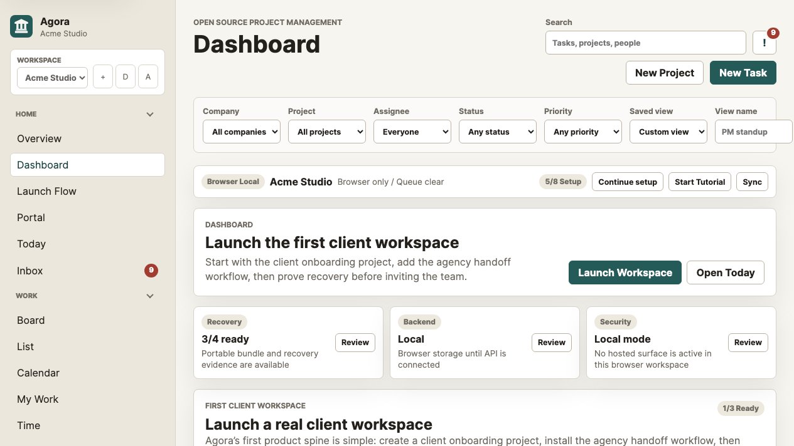
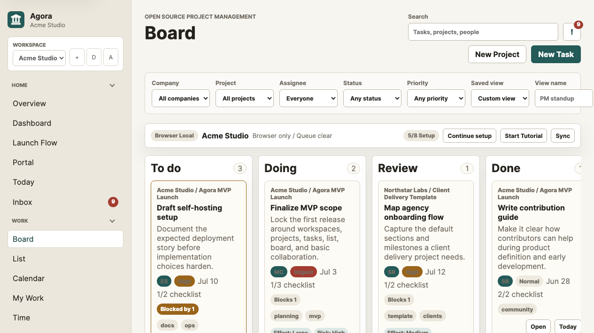
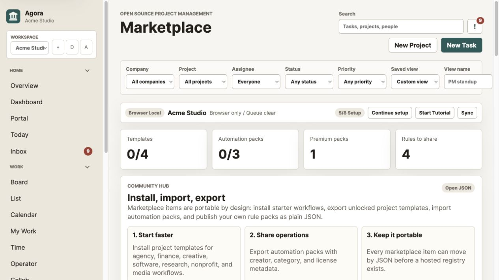

# Agora

[](https://github.com/thedudeb/Agora/actions/workflows/qa.yml)

Open source project management without ads, trackers, or lock-in.

Agora is a self-hostable project management workspace inspired by tools like Asana and Nifty. It is designed for teams that need projects, tasks, clients, daily planning, approvals, automations, time tracking, and visibility while keeping control of their data and workflow.



## Who Agora Is For

- Agencies and consultants that need client-safe portals, approvals, time, reports, and reusable delivery workflows.
- Open source and privacy-conscious teams that want project management without ads, trackers, or export lock-in.
- Operators who want AI assistance with permissions, previews, rationale, audit logs, and undo paths instead of mystery automation.

## Product Snapshot

| Workspace command center | Project board | Marketplace |
| --- | --- | --- |
|  |  |  |

Agora currently covers the core loop: plan work, move tasks, triage inbox signals, share client-safe status, install templates and automations, export the workspace, and connect an optional API when browser-local storage is not enough.

## What You Can Run Today

- Dependency-free browser app with seeded demo data, local persistence, backups, portable exports, an offline PWA shell, and an optional offline-capable desktop shell.
- Project views for dashboard, Today, inbox, board, list, calendar, sprint command center with planning mode, sprint automation previews, presets, and audit runs, sprint close preview/undo, review closeout history, editable roadmap sprints, burndown/burnup forecasts, velocity forecasts, AI scrum-master briefs, multi-sprint roadmaps, scenario planning, Jira/Linear/GitHub sprint sync payloads, draggable sprint timelines, and capacity overlays, timelines, reports, companies, client portal, docs/files, project backlog, intake, templates, automations, marketplace, data, audit, permissions, Operator, and settings.
- Dependency-free API scaffold with local JSON storage, optional Supabase storage/auth, structured records, marketplace catalog, payment-adapter skeleton, scheduler endpoints, and smoke tests.
- Plugin manifest skeleton with a validator, example plugin, and least-privilege contribution contract for commands, views, importers, templates, automation packs, MCP tools, and settings panels.
- Trust posture for self-hosters: no ads, no trackers, server-only secrets, role permissions, company-scoped access, portable bundles, and auditable AI actions.

## Status

Agora is in early prototype development. The current app is a dependency-free browser prototype with seeded workspace data, first-run onboarding, guided tutorial mode, launch-readiness guidance, a Cmd/Ctrl+K command palette, keyboard shortcuts, local multi-workspace switching, clean/demo workspace setup, local persistence, local workspace backups, PWA installability, an offline app shell, mobile task actions, customizable workspace themes, command-style search results, saved views with update/rename/pin controls, workspace settings, a Trust Center, member roles, a permission matrix, company-scoped access controls, team invitations, invite expiry/resend/revoke controls, first-owner signup, password login, Supabase email/password auth, password reset/change flows, optional passwordless API sessions, API-first company/project/task records, structured records endpoints, data import/export, switcher imports for common competitor CSV/JSON task exports, API snapshot sync, polling-based realtime refresh, a clear Settings split for account, trust, sync, integrations, payments, security, and developer readiness, a storage adapter foundation, optional Supabase snapshot and structured record persistence, authenticated file uploads/downloads, deployment readiness checks, a dependency-free API scaffold, optional demo auth, API rate limiting, scoped client and company writes, security headers, merged local/API audit log UI, a PostgreSQL schema draft, command-center inbox lanes, mention and watched-task notifications, a dedicated AI Operator page, local AI operator planning, server-side bring-your-own-AI adapters, operator briefs, previewable operator actions, an AI action ledger with rationale/data sources/undo, client/company portals, client approvals, live collaboration presence, same-page cursor presence, workspace chat, lightweight whiteboards, task-view awareness, stale edit warnings, workspace pulse, automation recommendations and previews, editable automation rules, rollbackable automation runs, company portfolios, objective/goal tracking, editable companies, project backlog scoring and promotion, sprint command center for scrum masters with planning mode, sprint automation previews, presets, and audit runs, sprint close preview/undo, review closeout history, editable roadmap sprints, burndown/burnup forecasts, velocity forecasts, AI scrum-master briefs, multi-sprint roadmaps, scenario planning, Jira/Linear/GitHub sprint sync payloads, draggable sprint timelines, and capacity overlays, daily task planning, inbox notifications, notification badges and toasts, configurable reporting dashboards, capacity planning, copyable status reports, a searchable project-template library and installable template marketplace for agency, software, finance, creative, marketing, research, nonprofit, media, and people workflows, a payment-provider foundation with local entitlements, creator-defined template pricing, charity-directed payout metadata, and gated premium template access for future Stripe/manual/x402 use, project and task templates that can be created from live work, automations, project docs and files, intake forms, custom task fields, task dependencies, Gantt-style timelines, project filters, project PM snapshots, task creation, project edit/duplicate actions, subtasks, comments, activity, employee time tracking, list view, board view, calendar view, project workspaces, milestones, project timelines, and a My Work view.

## Quick Start

Agora currently runs without package dependencies. You only need Node.js 18+ and npm.

1. Clone the repo and enter it.

```sh
git clone https://github.com/thedudeb/Agora.git
cd Agora
```

2. Create the local environment.

```sh
npm run setup
```

The default `.env` uses local JSON storage and serves the app at `http://127.0.0.1:5174`.

3. Start the web app.

```sh
npm run dev
```

Then open `http://127.0.0.1:5174`.

The prototype stores changes in browser local storage. Use the sidebar workspace switcher to create, duplicate, archive, and switch local workspaces. Use the Dashboard setup panel to choose demo data or start with a clean workspace. Use Data to create local workspace backups, download JSON exports, download or restore a portable workspace bundle with JSON/CSV/Markdown/operator context, replace the current workspace from JSON, or import JSON as a new workspace. Use "Reset sample data" in the sidebar to restore the seeded workspace.

4. Start the API in a second terminal.

```sh
npm run dev:api
```

Then open `http://127.0.0.1:8787/api/health`.

With both processes running, open Settings in the app and create the first owner account, then sign in with email and password. API-connected users can sync the workspace from the Data page. If the API is hosted somewhere other than `http://127.0.0.1:8787`, update the API URL in Settings.

The Dashboard includes first-run setup, launch-readiness panels, and a production onboarding checklist for connecting the API, confirming the owner, inviting teammates, checking backups, choosing an Operator preset, and exporting a recovery bundle. The Readiness page adds a hosted setup wizard, environment diagnostics that avoid exposing secrets, strict-CSP and dependency-audit checks, and one-click JSON/Markdown/copy exports for launch evidence. The Command Center gives PMs a daily cross-project view of overdue work, blockers, approvals, client promises, capacity pressure, open decisions, RAID items, requester updates, and client visibility warnings. The Decision Log turns chat messages and whiteboard notes into durable project decisions with owners, due dates, visibility, and links back to project context. Client Visibility review previews the shared/client-visible portal packet before clients see it, with inline visibility controls, preview-as-client mode, warnings for missing owners/dates/reviewers, a share packet composer, readiness-gated copy/email drafts, company-scoped portal links with expiry/revoke/rotate controls, and a local audit trail for exposure changes. The app chrome includes a connection banner for the current local/API mode, setup progress, sync queue state, and a guided Tutorial launcher. Press `Cmd+K` or `Ctrl+K` to open the command palette for navigation, creation, backups, API sync, automations, AI operator actions, and search-result jumps. Press `?` for keyboard help, `/` for search, `N` for a new task, `P` for a new project, `B` for a backup, or `G` then `D/T/B/I/S` to jump to Dashboard, Today, Board, Inbox, or Settings. Tutorial mode walks new users through setup, navigation, filters, work views, daily planning, inbox triage, Settings sync, and creating work. Settings separates account sign-in, workspace configuration, trust posture, sync state, payment-provider planning, security permissions, integrations, and developer readiness. The Trust tab summarizes portability, privacy posture, AI data-use policy, auditability, and recent AI actions with rationale and undo controls. The Integrations tab includes a connected-tools hub for Slack, GitHub, Google Drive, Google Calendar, Zapier, webhooks, API adapters, sync direction, ownership, subscribed event types, adapter health, signing-secret readiness, and auditable test events. The Payments tab stores provider choice, currency, spend caps, feature gates, x402 lab mode, local entitlements, premium-template grants, and a payment audit trail without moving money. When connected to the API, premium-template grants create a server checkout intent and store a server-issued entitlement through the test/manual payment adapter. The Sync tab shows the API source of truth, save/load controls, backend health refresh, and any failed local syncs waiting to retry. Data and Developer settings include the Backend Health panel after connecting to the API.

Release metadata is visible in `/api/health`, `/api/capabilities`, Backend Health, Admin Diagnostics, and Settings > Developer. Hosts can set `AGORA_RELEASE_COMMIT`, `AGORA_RELEASE_DATE`, and `AGORA_RELEASE_CHANNEL`; common Vercel and Render commit variables are detected automatically.

Workspace Settings include theme presets, density controls, and deployment readiness. Members and Security settings cover company-scoped access, invitations, current session access, and the role permission matrix so self-hosters can tune Agora before inviting a team.

The global toolbar can save filter setups as reusable views, then update, rename, pin, or forget them later. The Dashboard includes named saved layouts plus a widget picker for active projects, goals, capacity, operator signals, due-soon work, and mobile readiness. Data includes a preview-and-apply switcher import assistant for common competitor CSV/JSON exports from tools like Asana, ClickUp, monday, Trello, Jira, and Linear. Collaboration adds API-backed workspace chat channels plus a lightweight whiteboard for notes, decisions, and risks. Goals provide an objective ladder across companies, owners, linked projects, key results, progress, and portfolio health. Marketplace combines project-template packs, automation packs, install/import/export actions, API-backed catalog publishing, creator metadata, pricing, and charity payout details into one hub. Templates include built-in starter packs for client onboarding, software launch, finance close, art exhibition, marketing campaigns, and research sprints, with category filters, search, preview details, and a customization step before creating a project. The Templates page also includes a local marketplace for installable community packs, entitlement-gated premium packs, JSON export for unlocked templates, and JSON import for shared templates. Template creators can set price, currency, creator name, payout wallet/chain, charity recipient, and donation split metadata before exporting a template. Templates can also be created from existing projects or tasks and deleted from the Templates page. Automations include a structured workflow builder with trigger, condition, action, and action-target fields, plus preview, pause, delete, manual run controls, an open marketplace for installable/exportable/importable JSON workflow packs, and a pack authoring panel for turning local rules into shareable community packs. Admin includes a Permissions audit view for role scope, member access, import rights, and Operator guardrails. Reports include project health, company comparison, capacity planning, member workload, risk queues, and a copyable Markdown status report from the current company, project, assignee, status, and priority filters.

When connected to the API, Agora loads companies, projects, tasks, chat messages, and whiteboards from API records, adopts server-returned records after writes, polls for workspace and structured-record changes, merges server-canonical records back into the browser, shows live task viewers and same-page cursor presence, generates inbox items for mentions and watched tasks, and warns before saving over a task that changed while its modal was open.

The API also includes a payment-adapter skeleton for marketplace entitlements:

- `GET /api/payments/config` reports the available test, manual, Stripe, and x402 adapters.
- `POST /api/payments/checkout-intent` creates a server-side intent for a premium marketplace item. Stripe and x402 are intentionally stubbed until real server adapters are configured.
- `POST /api/payments/events` accepts test/manual completion events and writes a server-issued entitlement into the workspace snapshot.
- `GET /api/payments/entitlements` returns the server-issued entitlement list for connected clients.

The API marketplace registry lets connected workspaces share packs through the same storage driver:

- `GET /api/marketplace/catalog` returns hosted project templates and automation packs.
- `POST /api/marketplace/catalog` publishes normalized project templates and authored automation packs.
- `GET /api/marketplace/export/:type/:id` returns a portable project-template or automation-pack JSON payload.

## Useful Commands

```sh
npm run dev       # serve the browser app
npm run dev:api   # start the local API
npm start         # serve the browser app for a host/runtime
npm run start:api # start the API for a host/runtime
npm run setup     # create .env and local persistent directories
npm run demo:links # generate shareable demo tour links
npm run migrate:concierge -- tests/fixtures/trello-board.json --source trello-json --workspace tests/fixtures/workspace.json
npm run ecosystem # validate plugin/MCP extension registry
npm run trust     # run the Trust Center evidence report
npm run mcp       # start the local stdio MCP server for power-user clients
npm run plugins   # validate local plugin manifests
npm run check     # syntax-check app and server files
npm run qa        # release QA: quick verification + browser golden-path QA
npm run verify:quick # syntax + portable fixture validation + recovery stress test
npm run verify    # syntax + fixtures + recovery + API smoke test
npm run launch:check # quick verification + browser golden-path QA
npm run test:api  # run the dependency-free API smoke test
npm run test:fixtures # validate portable workspace and automation pack fixtures
npm run test:recovery # stress-test backup, portable import, and restore behavior
npm run drill:recovery -- --fixture # run an isolated disaster recovery drill
npm run test:golden # browser-check onboarding, marketplace, templates, and portable recovery
npm run test:plugins # validate plugin manifest contracts
npm run test:supabase # verify a real Supabase project end to end
npm run verify:supabase # verify + real Supabase project checks
npm run verify:upgrade # check migration files and latest server backup before upgrading production
npm run screenshots # refresh launch screenshots with local Chrome/Chromium
npm run agora -- verify # power-user CLI: check + fixtures + API smoke
npm run agora -- qa # power-user CLI: release QA gate
npm run agora -- demo links --base https://demo.example.com --markdown
npm run agora -- concierge tests/fixtures/trello-board.json --source trello-json --workspace tests/fixtures/workspace.json
npm run agora -- ecosystem
npm run agora -- trust
npm run agora -- upgrade check --backup tests/fixtures/server-backups/agora-workspace-backup-demo.json
npm run agora -- recovery-drill --fixture
npm run agora -- bundle inspect tests/fixtures/portable-workspace-bundle.json
npm run agora -- bundle inspect tests/fixtures/portable-workspace-bundle.json --json
npm run agora -- launch check tests/fixtures/portable-workspace-bundle.json
npm run agora -- marketplace validate templates/marketplace.json
npm run agora -- migrate preview tests/fixtures/trello-board.json --source trello-json
npm run agora -- migrate preview asana-export.csv --source asana-csv
npm run agora -- migrate apply tasks.csv --source generic-csv --workspace tests/fixtures/workspace.json --out imported-workspace.json
```

To use different local ports, set `AGORA_APP_PORT` or `AGORA_API_PORT` in `.env`. Add browser origins to `AGORA_ALLOWED_ORIGINS` when hosting the app somewhere other than localhost.

For MCP clients, set `AGORA_API_URL`, `AGORA_API_TOKEN`, and optionally `AGORA_MCP_ALLOW_WRITES=true`, then run `npm run mcp`. See [`docs/mcp-server.md`](./docs/mcp-server.md) for client config examples, tools, resources, and security notes.

For one-command setup and Docker Compose packaging, see [`docs/install.md`](./docs/install.md). The shortest path is `npm run setup`, then `npm run dev` and `npm run dev:api`; Docker users can run `npm run setup -- --profile docker` and `docker compose up --build`.

For hosted evaluation, generate scenario-specific demo links with `npm run demo:links -- --base <app-url> --markdown`. See [`docs/demo-workspaces.md`](./docs/demo-workspaces.md) for the agency, scrum, client portal, trust center, and marketplace demo catalog.

For migration work, the CLI can preview and apply Trello JSON or generic CSV exports before you touch a real workspace. Start with `npm run migrate:concierge -- <export-file> --workspace <workspace.json> --backup <backup.json>` for a guided readiness report, then use `npm run agora -- migrate preview/apply` when the warnings are understood. See [`docs/migration-tool.md`](./docs/migration-tool.md) for the adapter contract, safety model, mapping tables, and examples.

For plugin experiments, start with [`plugins/example-importer/plugin.json`](./plugins/example-importer/plugin.json), validate with `npm run test:plugins`, and read the [plugin architecture contract](./docs/plugin-architecture.md). The first plugin layer is declarative and local-first, so contributors can safely propose commands, views, importers, templates, automation packs, MCP tools, and settings panels before Agora enables runtime loading.

For the platform story across plugins, MCP, connectors, templates, automations, and marketplace artifacts, see [`docs/ecosystem.md`](./docs/ecosystem.md) and validate the registry with `npm run ecosystem`.

For trust evidence, run `npm run trust` or `npm run agora -- trust --json`. The report checks Agora's no-tracker runtime posture, security headers, redacted diagnostics, recovery drills, upgrade gates, portability, migration readiness, hosted readiness, and extension registry. See [`docs/trust-center.md`](./docs/trust-center.md).

For production upgrades, run `npm run verify:upgrade` before applying migrations or rolling a new API build, then run `npm run drill:recovery -- --backup <server-backup.json>` to prove restore mechanics in isolation. See [`docs/upgrade-checklist.md`](./docs/upgrade-checklist.md) and [`docs/disaster-recovery-drill.md`](./docs/disaster-recovery-drill.md) for the operator sequence and rollback trigger.

For power users and self-hosters, the lightweight CLI wraps common project operations:

```sh
npm run agora -- help
npm run agora -- verify
npm run agora -- verify --quick
npm run agora -- verify --supabase
npm run agora -- recovery
npm run agora -- trust
npm run agora -- screenshots
npm run agora -- golden
npm run agora -- bundle inspect tests/fixtures/portable-workspace-bundle.json
npm run agora -- bundle inspect tests/fixtures/portable-workspace-bundle.json --json
npm run agora -- launch check tests/fixtures/portable-workspace-bundle.json
npm run agora -- launch check tests/fixtures/portable-workspace-bundle.json --strict
npm run agora -- marketplace validate templates/marketplace.json
npm run agora -- migrate preview tests/fixtures/trello-board.json --source trello-json
npm run agora -- migrate preview tasks.csv --source generic-csv --json
npm run agora -- migrate preview jira-export.csv --source jira-csv
```

## Launch Preflight

Use this before pushing a release candidate:

```sh
npm run security
npm run trust
npm run verify:hosted
npm run rehearse:hosted
npm run qa
npm run verify
npm run launch:check
```

For a fast local confidence check while iterating:

```sh
npm run verify:quick
```

For hosted Supabase installs, configure `.env`, run all three migrations, create the private storage bucket, then run:

```sh
npm run verify:hosted
npm run verify:supabase
```

The Readiness page can export the same hosted launch evidence as JSON or Markdown after Backend Health has been refreshed.
`npm run verify:hosted` performs the pre-deploy environment check for Supabase mode, hosted URLs, strict CSP, reset/email delivery, public intake limits, and webhook-secret readiness without printing secret values.
`npm run rehearse:hosted` runs the hosted verifier, security checks, API smoke, backup/diagnostics proof, and browser golden path as a single deploy rehearsal report.

Demo auth and passwordless email login are disabled by default. For trusted demos only, set `AGORA_DEMO_AUTH=true` or `AGORA_PASSWORDLESS_AUTH=true` and restart `npm run dev:api`.

For automation clients, native shells, and future agent integrations, see the [Agora API agent contract](./docs/api-agent-contract.md). It documents the authenticated API boundary, role permissions, scoped reads, write confirmations, and token-handling expectations.

Admins can also review high-impact permissions, danger-zone actions, recent admin activity, and role-preview access from Settings > Security or the Permissions audit.

For the public product direction, see [`ROADMAP.md`](./ROADMAP.md) and [`CONTRIBUTING.md`](./CONTRIBUTING.md). For security reporting and deployment hardening, see [`SECURITY.md`](./SECURITY.md). For deployment details, hosted launch cutover, Vercel static hosting, Supabase setup, SMTP/webhook password reset delivery, desktop app packaging, and release checks, see [`docs/deployment.md`](./docs/deployment.md), [`docs/hosted-launch-runbook.md`](./docs/hosted-launch-runbook.md), [`docs/supabase-setup.md`](./docs/supabase-setup.md), and [`docs/desktop-app.md`](./docs/desktop-app.md). For beta handoff, see [`BETA.md`](./BETA.md), [`docs/beta-test-script.md`](./docs/beta-test-script.md), [`docs/beta-notes.md`](./docs/beta-notes.md), and [`docs/release-checklist.md`](./docs/release-checklist.md). For marketing positioning, launch copy, and screenshot planning, see [`docs/marketing-strategy.md`](./docs/marketing-strategy.md), [`docs/launch-kit.md`](./docs/launch-kit.md), and [`docs/screenshot-demo-plan.md`](./docs/screenshot-demo-plan.md). For portable bundle structure, restore details, workspace schema migrations, and migration tooling, see [`docs/portable-workspace.md`](./docs/portable-workspace.md), [`docs/schema-migrations.md`](./docs/schema-migrations.md), and [`docs/migration-tool.md`](./docs/migration-tool.md).

## Supabase Storage

Agora works out of the box with local JSON API storage. To use Supabase for API persistence:

For the full step-by-step path, troubleshooting table, and pre-launch gate, see [`docs/supabase-setup.md`](./docs/supabase-setup.md).

1. Create a Supabase project.
2. Run `server/migrations/001_supabase_storage.sql`, `server/migrations/002_supabase_auth_rls.sql`, and `server/migrations/003_background_jobs.sql` in the Supabase SQL editor.
3. Create a private Supabase Storage bucket named `agora-files`.
4. Set these values in `.env`:

```sh
AGORA_STORAGE_DRIVER=supabase
AGORA_AUTH_DRIVER=supabase
SUPABASE_URL=https://your-project.supabase.co
SUPABASE_ANON_KEY=your-anon-key
SUPABASE_SERVICE_ROLE_KEY=your-service-role-key
AGORA_SUPABASE_STORAGE_BUCKET=agora-files
```

5. Restart `npm run dev:api`.

Keep `SUPABASE_SERVICE_ROLE_KEY` server-only. Do not paste it into browser settings or client code. `SUPABASE_ANON_KEY` is safe for browser-based Supabase Auth clients, but Agora's API still reads it from the server environment when validating access tokens.

`002_supabase_auth_rls.sql` adds `public.agora_workspace_memberships`, helper functions around `auth.uid()`, and RLS policies for snapshots, audit events, and structured record tables. `003_background_jobs.sql` persists retryable email and worker job state. The API can sign users up or in with Supabase email/password auth from Settings, exchange a Supabase Auth `access_token`, or accept that token directly as a Bearer token when `AGORA_AUTH_DRIVER=supabase`.

Invitations and memberships can be assigned to a company. Scoped users only receive the company workspace records they are allowed to see, and whole-workspace snapshot saves stay limited to workspace-wide admin sessions.

Use the Backend Health panel, or `GET /api/backend/health` with an authenticated bearer token, to confirm that Supabase storage, Supabase Auth, RLS-backed memberships, workspace snapshots, and structured records are reachable.

After running both migrations and creating the private storage bucket, run `npm run test:supabase` to verify the real Supabase project through the Agora API. The verifier uses a unique temporary workspace by default and checks snapshots, structured records, notification scheduler permissions, payment entitlements, audit events, and Supabase Storage upload/download without deleting existing rows.

## AI Operator

Agora includes a local deterministic operator by default, plus an optional server-side adapter for OpenAI-compatible APIs, Ollama, or a custom endpoint. Provider secrets stay on the API server. The Operator page also shows a trust and context panel with provider, data policy, visible context, audit mode, admin-governed permission presets, and a downloadable operator context bundle.

```sh
AGORA_AI_PROVIDER=openai
AGORA_AI_MODEL=gpt-4o-mini
AGORA_AI_BASE_URL=https://api.openai.com/v1
AGORA_AI_API_KEY=your-server-side-key
```

For Ollama:

```sh
AGORA_AI_PROVIDER=ollama
AGORA_AI_MODEL=llama3.1
AGORA_AI_BASE_URL=http://127.0.0.1:11434
```

Restart `npm run dev:api`, connect to the API from Settings, then open Operator to draft workspace and project briefs. Operator can also preview and apply task follow-ups, approval requests, approval chases, Today planning, and client updates while recording each applied action in the workspace log. Keep `AGORA_AI_API_KEY` server-only.

## Product Principles

- Clear enough for non-technical teams.
- Practical enough for day-to-day project work.
- Open enough to self-host, inspect, extend, and contribute to.
- Focused enough to avoid becoming a bloated all-in-one workspace.

## Planned MVP

- Workspaces, members, and roles.
- Projects with list, board, and calendar or timeline views.
- Tasks with assignees, due dates, priorities, comments, attachments, and subtasks.
- Project dashboards for progress, overdue work, milestones, and recent activity.
- Templates for common workflows such as product roadmaps, client delivery, campaigns, and operations.
- Self-hosting documentation, data export, and an initial integration surface.

## Repository Structure

- `prds/` contains product requirements and planning documents.
- `index.html` contains the first browser prototype shell.
- `src/` contains prototype application logic and styles.
- `server/` contains the dependency-free app server, API scaffold, JSON development storage, Supabase migration, and PostgreSQL schema draft.
- `docs/mobile-strategy.md` outlines the offline-first PWA path toward a dedicated mobile app.
- `docs/desktop-app.md` covers the optional offline-capable Electron shell for Windows and macOS.
- `templates/` contains marketplace template examples and contribution format notes.
- `assets/` contains brand and interface assets.
- `ROADMAP.md` outlines the release direction.
- `CONTRIBUTING.md` explains how to contribute.
- `.github/ISSUE_TEMPLATE/` contains starter issue templates.

## Name

In ancient Greece, the agora was a public gathering place for discussion, trade, and civic organization. This project uses that idea as a metaphor for a shared place where teams gather around their work.

## License

Agora is licensed under the GNU Affero General Public License v3.0. See `LICENSE` for details.
